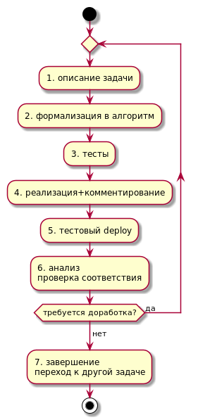

## Руководство разработчика

### Вечные проблемы разработки 

* Отсутствие адекватной документации в коде и для пользователя
* Непонимание "чего тут понаписано" при смене разработчика
* Плохо протестированная функциональность

**Следует придерживаться основных правил и шагов разработки**

### Основные правила

* Вся документация и код должны разрабатываться одновременно
* Код должен храниться в системе контроля версий
* Комментарии в коде 
* Стараться тестировать всю логику по (принцип TDD)

 
#### Виды документации

* Документация разработчика, включая технические вопросы сборки и запуска
* Руководство пользователя
* Комментарии в коде 

### Цикл разработки 

1. Описание задачи в свободной форме (Тезисы, User Story)
2. Формализация в алгоритм
3. Тестовый код
4. Реализация + комментарии в коде 
5. Проверка сборки и запуска
6. Анализ полученного, проверка соответствия задачи, документации и работы приложения
7. Итеративное редактирование (пп. 1-6) или переход к другой задаче

***

Далее: [спецификация](specs.md)

