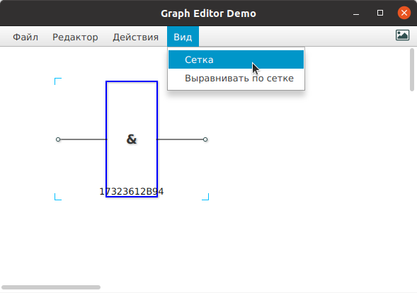
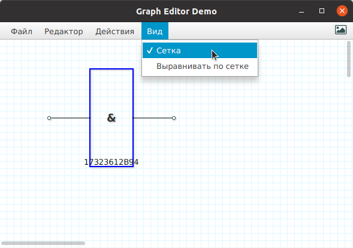
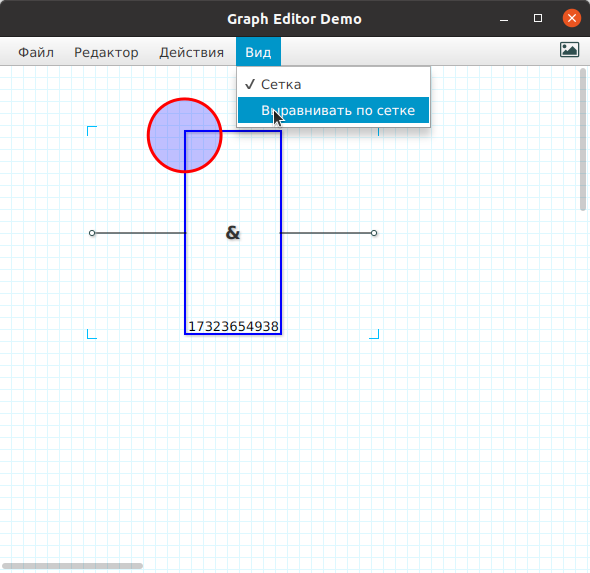
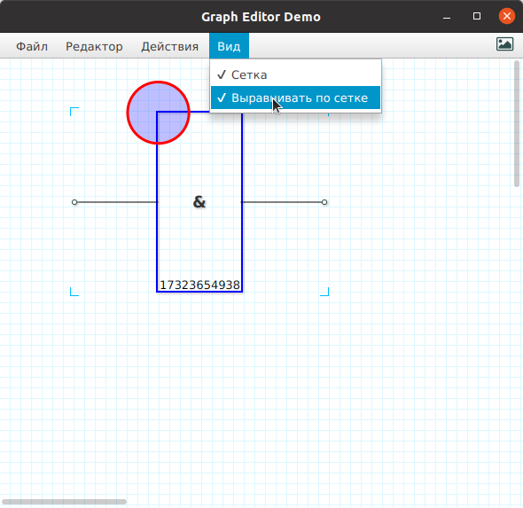

### Меню "Вид"

#### Меню "Сетка"

Включает / выключает отображение сетки на экране.

| без сетки | с сеткой |
| :-------: | :-----:  |
| |  |
 

#### Меню "Выравнивать по сетке"

Автоматическое выравнивание узлов по линиям сетки при перемещении мышкой по схеме.

| без выравнивания | с выравниванием |
| :-------: | :-----:  |
| |  |

