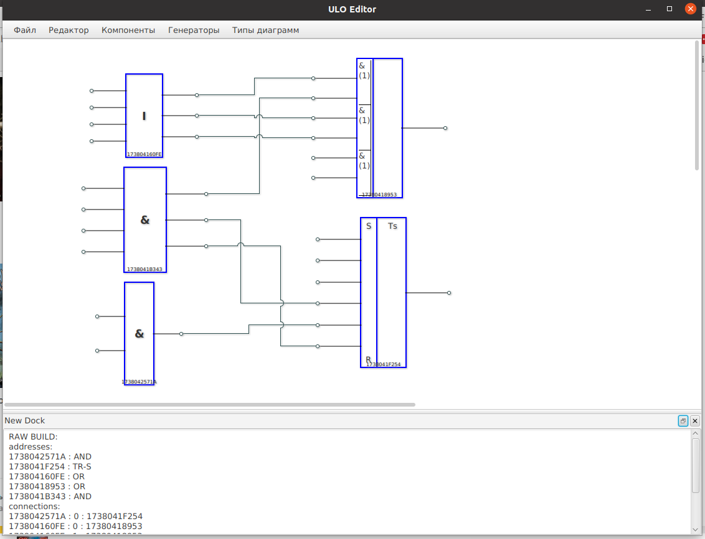

## Разработка архитектуры 

Исходя из поставленных задач, ГРАФ должен позволять создавать 
полноценную графическую интерпретацию алгоритма ULO, так чтобы используя 
только его возможности, можно было отобразить и впоследствии сгенерировать 
любой текущий полноценный алгоритм. Справедливо и обратное требование, 
когда из рабочего алгоритма можно получить его графическое отображение 
с последующим редактированием.

Набор пользовательских инструментов должен включать в себя 
инструменты создания функциональных элементов, их редактирования, 
связывания, перемещения, масштабирования, копирования и вставки – 
классический набор визуальных  редакторов, чтобы использовать 
типовой опыт работы с любыми графическими редакторами.

### Модули редактора

* Модуль редактирования схемы
* Модуль генерации бинарного файла формата ULO
* Модуль импорта бинарного файла формата ULO
* Модуль вывода на печать
* Модуль справки по функциям

## Выбор языка программирования и среды разработки, выбор библиотек с проверкой лицензионной чистоты

В качестве языка программирования выбран Java в сборке OpenJDK в комплекте 
с графическими модулями JavaFX в сборке OpenJFX. На сегодня это безопасные сборки 
с лицензией GPL (исключением является `Classpath`, безопасно 
для коммерческого использования).

## Разработка дизайна редактора.
Поле редактора будет выглядеть как-то так:

